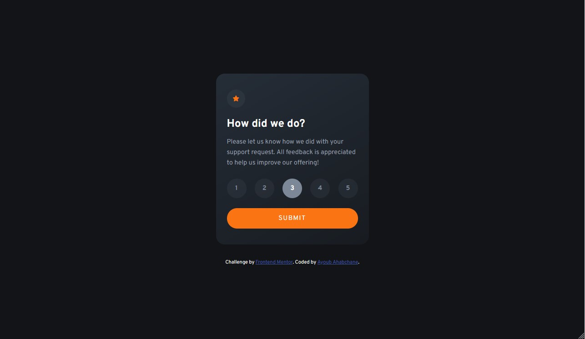

# Frontend Mentor - Interactive rating component solution

This is a solution to the [Interactive rating component challenge on Frontend Mentor](https://www.frontendmentor.io/challenges/interactive-rating-component-koxpeBUmI). Frontend Mentor challenges help you improve your coding skills by building realistic projects.

## Table of contents

- [Frontend Mentor - Interactive rating component solution](#frontend-mentor---interactive-rating-component-solution)
  - [Table of contents](#table-of-contents)
  - [Overview](#overview)
    - [The challenge](#the-challenge)
    - [Screenshot](#screenshot)
    - [Links](#links)
  - [My process](#my-process)
    - [Built with](#built-with)
    - [What I learned](#what-i-learned)
    - [Continued development](#continued-development)
  - [Author](#author)

## Overview

### The challenge

Users should be able to:

- View the optimal layout for the app depending on their device's screen size
- See hover states for all interactive elements on the page
- Select and submit a number rating
- See the "Thank you" card state after submitting a rating

### Screenshot

### Links

- Solution URL: [Add solution URL here](https://your-solution-url.com)
- Live Site URL: [Add live site URL here](https://your-live-site-url.com)

## My process

### Built with

- Semantic HTML5 markup
- CSS custom properties
- Flexbox
- CSS Grid
- Mobile-first workflow

### What I learned

This was an opportunity for me to practice the basics of HTML, CSS and Javascript, along with other technologies that assist in the art of web development.

### Continued development

I'm in the process of developing a workflow that is backed by experience and familiarity with the types of tasks that I might run into as a web developer. So while I might take longer than usual accomplishing individual components, I'm hopeful that with perseverence, i'll build the muscle memory and the foresight that will increase my effectiveness.

## Author

- Frontend Mentor - [@ayoub-ahabchane](https://www.frontendmentor.io/profile/ayoub-ahabchane)
- Twitter - [@Ayoub_Ahabchane](https://twitter.com/Ayoub_Ahabchane)
